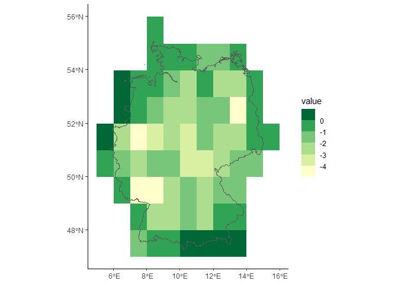

<!-- README.md is generated from README.Rmd. Please edit that file -->

# ebvcube package

<!-- badges: start -->

[](https://github.com/LuiseQuoss/ebvcube/actions)
<!-- badges: end -->

This package can be used to easily access the data of the EBV netCDFs
which can be downloaded from the [GEO BON
Portal](https://portal.geobon.org/). It also provides some basic
visualization. Advanced users can build their own netCDFs with the EBV
standard.

## 1. EBVs - Essential Biodiversity Variables

The EBV netCDF standard is designed to hold Essential Biodiversity
Variables. This concept is further described
[here](https://geobon.org/ebvs/what-are-ebvs/). An important core
element of the EBV netCDFs is their nested structure. All datacubes in
the netCDF are assigned to one metric. But this metric can have several
entities. On top of this hierarchy there can be several scenarios. The
following block displays an abstract exhausted hierarchy.

### 3D structure

The datacubes have the dimensions longitude, latitude and time (will
most likely be deprecated).

``` bash
├── scenario_1
│   └── metric_1
│       ├── entity_1
│       ├── entity_2
│       ├── ...
│       └── entity_999
└── scenario_2
    └── metric_2
        ├── entity_1
        ├── entity_2
        ├── ...
        └── entity_999
```

### 4D structure

The datacubes have the dimensions longitude, latitude, time and entity.

``` bash
├── scenario_1
│   └── metric_1
│       └── ebv_cube
└── scenario_2
    └── metric_2
        └── ebv_cube
```

The following is a practical example of the netCDF structure (3D). Basis
is the [global habitat availability for mammals
dataset](https://portal.geobon.org/ebv-detail?id=5).

``` bash
├── SSP1-RCP2.6
│   └── absolute values per 5 years and species (km2)
│       ├── Hipposideros calcaratus
│       ├── Hipposideros fulvus
│       ├── ...
│       └── Habromys lepturus
│
├── SSP2-RCP4.5
│   └── absolute values per 5 years and species (km2)
│       ├── ...
│       └── Habromys lepturus
├── ...
│
└── SSP5-RCP8.5
    └── absolute values per 5 years and species (km2)
        ├── ...
        └── Habromys lepturus    
```

Just keep in mind: All EBV netCDF always have a metric. But they may or
may not have a scenario. The resulting datacubes hold the data. These
datacubes can be 3D or 4D. The latter is going to be the standard (3D is
about to be deprecated).

## 2. Installation

You can install the ebvcube packages with:

``` r
devtools::install_github('https://github.com/LuiseQuoss/ebvcube')
```

This packages uses GDAL tools (GDAL version: 3.1.4). You need a GDAL
installation on your machine. One possibility to install GDAL is the
[OSGeo4W Network installer](https://trac.osgeo.org/osgeo4w/). Check GDAL
when running the installation! If you have QGIS on your machine, GDAL
should be included. To check that, install the gdalUtils package in R
and run gdalUtils::gdal_setInstallation(). It takes quite a while the
first time as it looks for a GDAL installation. Now
getOption(‘gdalUtils_gdalPath’) should return the GDAL installation. If
you have problems you can set the GDAL related paths by hand using the
following lines of code. Your paths will differ! First check your GDAL
installation.

``` r
# #add GDAL path to the existing paths
# Sys.setenv(PATH = paste0('C:\\OSGeo4W64\\bin;',Sys.getenv("PATH")))
# #check and change path for proj_lib, gdal_data and gdal_driver_path
# Sys.setenv(PROJ_LIB = 'C:\\OSGeo4W64\\share\\proj')
# Sys.setenv(GDAL_DATA = 'C:\\OSGeo4W64\\share\\gdal')
# Sys.setenv(GDAL_DRIVER_PATH = 'C:\\OSGeo4W64\\bin\\gdalplugins')

#you can always check your GDAL path settings using
Sys.getenv("PATH")
#> [1] "C:\\OSGeo4W64\\bin;C:\\rtools40\\usr\\bin;C:\\OSGeo4W64\\bin;C:\\rtools40\\usr\\bin;C:\\Users\\lq39quba\\Documents\\R\\R-4.1.2\\bin\\x64;C:\\Program Files\\Common Files\\Oracle\\Java\\javapath_target_7100531;C:\\Program Files (x86)\\Common Files\\Oracle\\Java\\javapath_target_8241906;C:\\Windows\\System32;C:\\Windows;C:\\Windows\\System32\\wbem;C:\\Windows\\System32\\WindowsPowerShell\\v1.0;C:\\Windows\\System32\\OpenSSH;C:\\Program Files\\Git\\cmd;C:\\Program Files\\PuTTY;C:\\Users\\lq39quba\\AppData\\Local\\Programs\\MiKTeX\\miktex\\bin\\x64;C:\\Program Files\\RStudio\\bin\\pandoc;C:\\Program Files\\netCDF 4.8.0\\bin;C:\\Users\\lq39quba\\AppData\\Local\\Programs\\Python\\Python39\\Scripts;C:\\Users\\lq39quba\\AppData\\Local\\Programs\\Python\\Python39;C:\\Users\\lq39quba\\AppData\\Local\\Microsoft\\WindowsApps;C:\\Users\\lq39quba\\AppData\\Local\\Programs\\MiKTeX\\miktex\\bin\\x64"
Sys.getenv("PROJ_LIB") 
#> [1] "C:\\OSGeo4W64\\share\\proj"
Sys.getenv("GDAL_DATA") 
#> [1] "C:\\OSGeo4W64\\share\\gdal"
Sys.getenv("GDAL_DRIVER_PATH") 
#> [1] "C:\\OSGeo4W64\\bin\\gdalplugins"
```

## 3. Working with the package - a quick intro

### 3.1 Take a very first look at the file

With the following two functions you get the core information about the
data of a specific EBV netCDF. First we take a look at some basic
metadata of that file. The properties encompass much more information!

``` r
library(ebvcube)

#set the path to the file
file <- system.file(file.path("extdata","cSAR_idiv_v1.nc"), package="ebvcube")

#read the properties of the file
prop.file <- ebv_properties(file)

#take a look at the general properties of the dataset - there are more properties to discover!
prop.file@general
#> $title
#> [1] "Changes in local bird diversity (cSAR)"
#> 
#> $description
#> [1] "Changes in bird diversity at the grid cell level caused by land-use, estimated by the cSAR model (Martins & Pereira, 2017). It reports changes in species number (percentage and absolute), relative to 1900, for all bird species, forest bird species, and non-forest bird species in each cell. Uses the LUH 2.0 projections for land-use, and the PREDICTS coefficients for bird affinities to land-uses."
#> 
#> $ebv_class
#> [1] "Community composition"
#> 
#> $ebv_name
#> [1] "Species diversity"
#> 
#> $ebv_subgroups
#> [1] "scenario" "metric"   "entity"  
#> 
#> $creator
#> [1] "Ines Martins"
slotNames(prop.file)
#> [1] "general"  "spatial"  "temporal" "metric"   "scenario" "ebv_cube"
```

Now let’s get the paths to all possible datacubes. The resulting
dataframe includes the paths and also descriptions of the metric and/or
scenario and/or entity. The paths basically consist of the nested
structure of scenario, metric and the datacube.

``` r
datacubes <- ebv_datacubepaths(file)
datacubes
#>   datacubepaths    scenario_names metric_names             entity_names
#> 1   past/mean/0 past: 1900 - 2015         mean non forest birds species
#> 2   past/mean/A past: 1900 - 2015         mean         all brid species
#> 3   past/mean/F past: 1900 - 2015         mean      forest bird species
```

In the next step we will get the properties of one specific datacube -
fyi: the result also holds the general file properties from above.

``` r
prop.dc <- ebv_properties(file, datacubes[1,1])
prop.dc@ebv_cube
#> $description
#> [1] "Changes in bird diversity at the grid cell level caused by land-use, estimated by the cSAR model (Martins & Pereira, 2017). It reports changes in species number (percentage and absolute), relative to 1900, for all bird species, forest bird species, and non-forest bird species in each cell. Uses the LUH 2.0 projections for land-use, and the PREDICTS coefficients for bird affinities to land-uses."
#> 
#> $standard_name
#> [1] "non forest birds species"
#> 
#> $units
#> [1] "mean change of species diversity per area (pixel size) to baseline 1900 "
#> 
#> $type
#> [1] "H5T_IEEE_F32LE"
#> 
#> $fillvalue
#> [1] -3.4e+38
```

### 3.2 Plot the data to get a better impression

To discover the spatial distribution of the data, you can plot a map of
the datacube that we just looked at. It has 12 timesteps. Here we look
at the sixth one.

``` r
#plot the global map
dc <- datacubes[1,1]
ebv_map(file, dc, timestep = 6)
#> Quantiles based on all layers.
```


``` r
# What was the data about again? Check the properties!
prop.dc@general$title
#> [1] "Changes in local bird diversity (cSAR)"
# And the datacube?
prop.dc@ebv_cube$standard_name
#> [1] "non forest birds species"
#What time is the sixth timestep representing?
prop.dc@temporal$timesteps_natural[6]
#> [1] "1960-01-01"
```

It’s nice to see the global distribution, but how is the change of that
datacube (non forest birds) over time? Let’s take a look at the average.
The function returns the values, catch them!

``` r
#get the averages and plot
averages <- ebv_indicator(file, dc)
#> [1] "calculating timesteps..."
#> ================================================================================
```


``` r
averages
#>  [1] 0.4363360 0.4363360 0.8548256 1.2845690 1.7785023 2.2481552 2.8426603
#>  [8] 3.1457002 3.3955101 3.6569338 3.8845097 4.0115587
```

It would be cool to have that for other indicators as well? Well you
have to wait for an update of the package. Or maybe implement it
yourself using the functions coming up next?

### 3.3 Read the data from the files to start working

Before you actually load the data it may be nice to get an impression of
the value range and other basic measurements.

``` r
#info for whole dataset
measurements <- ebv_analyse(file, dc)
#see the included measurements
names(measurements)
#> [1] "min"  "q25"  "q50"  "mean" "q75"  "max"  "std"  "n"    "NAs"
#how many pixels are included?
measurements$n
#> [1] 64800
measurements$mean
#> [1] 0.436336

#info for a subset defined by a bounding box (roughly(!) Germany)
bb <- c(5,15,47,55)
measurements.bb <- ebv_analyse(file, dc, subset = bb)
#how many pixels are now included?
measurements.bb$n
#> [1] 80
measurements.bb$mean
#> [1] -0.5584893
```

To access the data you can use the following:

``` r
#load whole data as array for two timesteps
data <- ebv_read(file, dc, timestep = c(1,2), type = 'a')
dim(data)
#> [1] 180 360   2
```

To subset the data using a shapefile you need to indicate a directory
for temporarily created files.

``` r
Sys.setenv(PATH = paste0('C:\\OSGeo4W64\\bin;',Sys.getenv("PATH")))
Sys.setenv(PROJ_LIB = 'C:\\OSGeo4W64\\share\\proj')
Sys.setenv(GDAL_DATA = 'C:\\OSGeo4W64\\share\\gdal')
Sys.setenv(GDAL_DRIVER_PATH = 'C:\\OSGeo4W64\\bin\\gdalplugins')

#load subset from shapefile (Germany)
shp <- system.file(file.path('extdata','subset_germany.shp'), package="ebvcube")
#define directory for temporary files
options('ebv_temp'=system.file("extdata/", package="ebvcube"))
data.shp <- ebv_read_shp(file, dc, shp = shp, timestep = c(1,2,3))
dim(data.shp)
#> [1]  9 11  3
#very quick plot of the resulting raster plus the shapefile
shp.data <- rgdal::readOGR(shp)
#> OGR data source with driver: ESRI Shapefile 
#> Source: "C:\Users\lq39quba\AppData\Local\Temp\RtmpSicWjb\temp_libpath46d4733157da\ebvcube\extdata\subset_germany.shp", layer: "subset_germany"
#> with 1 features
#> It has 94 fields
#> Integer64 fields read as strings:  POP_EST NE_ID
raster::spplot(data.shp[[1]], sp.layout = list(shp.data, first=FALSE))
```


Imagine you have a very large dataset but only limited memory. The
package provides the possibility to load the data as a DelayedArray. A
second function helps you to write that data back on disk properly. Look
into the manual to obtain more information.

### 3.4 Take a peek on the creation of an EBV netCDF

#### a. Create an empty EBV netCDF (with metadata)

This process is still work in progress. Right now you’ll have to insert
all the metadata in the [EBV Portal](https://portal.geobon.org/home) and
then use the resulting text file (json format) to create an empty netCDF
which complies to the EBV netCDF standard. It has the correct structure
and holds the metadata. Additionally to that (json) text file the
function needs a list of all entities the netCDF (csv list, see help
page for detailed information) will encompass and geospatial information
such as the coordinate reference system.

The example is based on the [Global habitat availability for
mammals](https://portal.geobon.org/ebv-detail?id=5). As its ID in the
geoportal is 5 the json file is just called 5.

``` r
#paths
json <- system.file(file.path('extdata','metadata.json'), package="ebvcube")
newNc <- file.path(system.file(package="ebvcube"),'extdata','test.nc')
entities <- file.path(system.file(package='ebvcube'),"extdata","entities.csv")
#defining the fillvalue - optional
fv <- -3.4e+38
#create the netCDF using the 4D cube representation
ebv_create(jsonpath = json, outputpath = newNc, entities = entities, overwrite=T,
           fillvalue = fv, prec='float', force_4D = TRUE)
#> [1] "Warning: shuffle is turned on for variable test_var but that var is of precision float and shuffle ONLY has an effect for integer variables."
#> [1] "Warning: shuffle is turned on for variable scenario_1/metric_1/ebv_cube but that var is of precision float and shuffle ONLY has an effect for integer variables."

#needless to say: check the properties of your newly created file to see if you get what you want
#especially the entity_names from the slot general should be checked to see if your csv was formatted the right way
print(ebv_properties(newNc)@general[1])
#> $title
#> [1] "Local bird diversity (cSAR/BES-SIM)"

#check out the (still empty) datacubes that are available
dc.new <- ebv_datacubepaths(newNc)
print(dc.new)
#>                  datacubepaths    scenario_names
#> 1 scenario_1/metric_1/ebv_cube past: 1900 - 2015
#>                                   metric_names
#> 1 Relative change in the number of species (%)
```

Hint: You can always take a look at your netCDF in
[Panoply](https://www.giss.nasa.gov/tools/panoply/) provided by NASA.
That’s very helpful to understand the structure.

#### b. Add your data to the EBV NetCDF

In the next step you can add your data to the netCDF from GeoTiff files
or in-memory objects (matrix/array). You need to indicate the
datacubepath the data belongs to. You can add your data timestep per
timestep, in slices or all at once. You can simply add more data to the
same datacube by changing the timestep definition.

``` r
#path to tif with data
root <- system.file(file.path('extdata'), package="ebvcube") 
tifs <- c('entity1.tif', 'entity2.tif', 'entity3.tif')
tif_paths <- file.path(root, tifs)
#adding the data
entity <- 1
for (tif in tif_paths){
  ebv_add_data(filepath_nc = newNc, datacubepath=dc.new[1,1], entity = entity,
              timestep=1:3, data = tif, band=1:3)
  entity <- entity + 1
}
#> The fillvalue of the GeoTiff (value: -Inf) differs from
#>                    the fillvalue of the datacube: -3.39999995214436e+38.
#> The fillvalue of the GeoTiff (value: -Inf) differs from
#>                    the fillvalue of the datacube: -3.39999995214436e+38.
#> The fillvalue of the GeoTiff (value: -Inf) differs from
#>                    the fillvalue of the datacube: -3.39999995214436e+38.
```

#### c. Add missing attributes to datacube

Ups! So you did a mistake and want to change the attribute?! No problem.
Just use the upcoming function to change it.

``` r
ebv_attribute(newNc, attribute_name='units', value='percentage', levelpath=dc.new[1,1])
#check the properties one more time - perfect!
print(ebv_properties(newNc, dc.new[1,1])@ebv_cube$units)
#> [1] "percentage"
```

In this case the levelpath corresponds to the datacube path. But you can
also alter attributes at the metric or scenario level. See the manual
for more info.

## 4. Cite package

``` r
citation('ebvcube')
#> 
#> To cite ebvcube in publications use:
#> 
#> Quoss L, Fernandez N, Langer C, Valdez J, Pereira H (2021). _ebvcube:
#> Working with netCDF for Essential Biodiversity Variables_. German
#> Centre for Integrative Biodiversity Research (iDiv) Halle-Jena-Leipzig,
#> Germany. R package version 0.0.1, <URL:
#> https://github.com/LuiseQuoss/ebvcube>.
#> 
#> Ein BibTeX-Eintrag für LaTeX-Benutzer ist
#> 
#>   @Manual{,
#>     title = {ebvcube: Working with netCDF for Essential Biodiversity Variables},
#>     author = {Luise Quoss and Nestor Fernandez and Christian Langer and Jose Valdez and Henrique Miguel Pereira},
#>     year = {2021},
#>     note = {R package version 0.0.1},
#>     organization = {German Centre for Integrative Biodiversity Research (iDiv) Halle-Jena-Leipzig},
#>     address = {Germany},
#>     url = {https://github.com/LuiseQuoss/ebvcube},
#>   }
```
